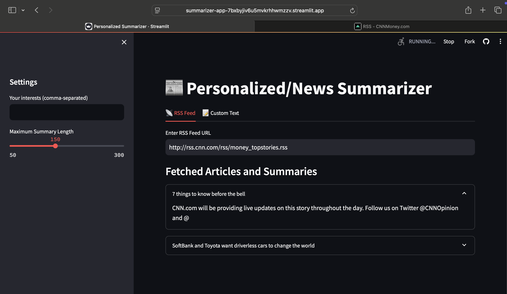
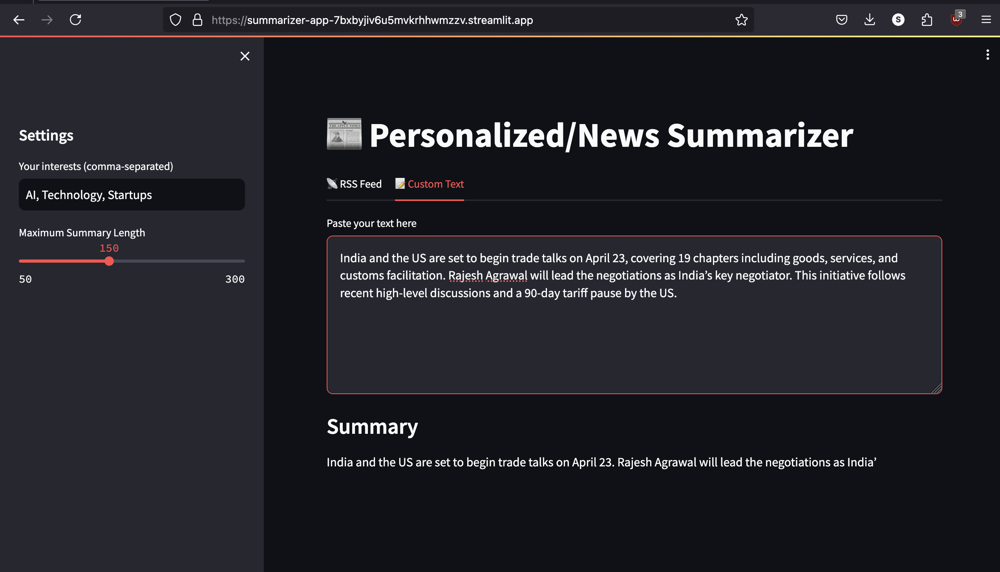

# 📰 Personalized News & Text Summarizer
<br>
<br>
This is a Streamlit-based web application that summarizes news articles from RSS feeds and user-provided text using NLP transformer models.
<br>
## 🚀 Features
<br>
<br>
- 🔍 Input any RSS feed URL
- ✨ Personalized summaries based on your interests (keywords)
- 🤖 AI-based summarization using `facebook/bart-large-cnn`
- 📄 Summarize any custom long-form text
- 🧠 Future-ready for topic modeling with BERTopic (already integrated)

---
<br>

## 🛠️ Tech Stack

- **Frontend:** Streamlit
- **NLP:** Hugging Face Transformers (`facebook/bart-large-cnn`)
- **RSS Parsing:** feedparser, requests
- **Optional NLP Tools:** BERTopic for topic modeling
- **Deployment Ready:** Can be hosted on Streamlit Cloud, Heroku, or local

---
<br>

## 📦 Installation

```bash
# Clone the repository
git clone https://github.com/yourusername/news-summarizer.git
cd news-summarizer

# (Optional) Create a virtual environment
python -m venv env
source env/bin/activate  # On Windows use `env\Scripts\activate`

# Install dependencies
pip install -r requirements.txt


```

## Usage

Run the app locally
streamlit run app.py


## Live Link
https://summarizer-app-7bxbyjiv6u5mvkrhhwmzzv.streamlit.app


## Images






